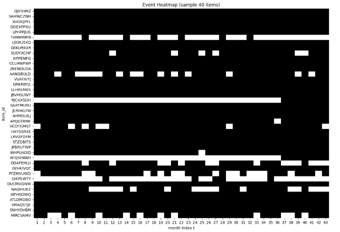
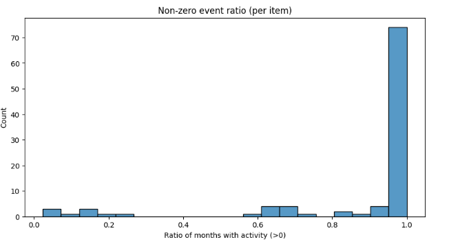
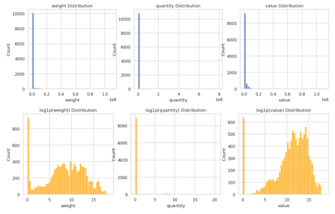
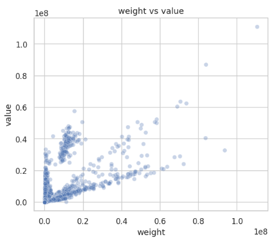
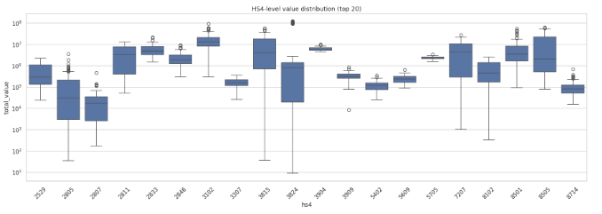
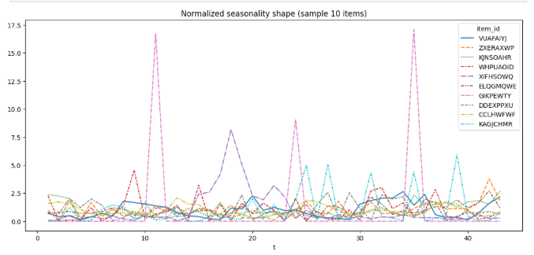

### 🏫 제3회 국민대학교 AI빅데이터 분석 경진대회  
**주제:** 품목 간 무역 연동성 분석 및 미래 예측  
**주최:** 국민대학교 경영대학원 · 한국기계산업진흥회(KOAMI)

팀 레포: https://github.com/Girls-Night/dacon-trade-forecast-team_girls_night 

---

# 1. Introduction

## 1.1 대회 개요
본 프로젝트는 국민대학교 경영대학원과 한국기계산업진흥회(KOAMI)가 주최한  
**제3회 국민대학교 AI빅데이터 분석 경진대회**를 기반으로 수행되었다.  

대회는 2022년 1월부터 2025년 7월까지 제공된  
**100개 수입 품목의 월별 무역 데이터를 활용해**,  

1) 품목 간 **공행성(comovement)** 관계를 탐지하고  
2) 선행 품목의 흐름을 기반으로 후행 품목의 **다음달 무역량(value)**을 예측하는  

AI 모델을 구축하는 것이 목표이다.

즉, 단순한 시계열 예측이 아니라  
**구조적 관계 탐색 + 조건부 회귀 예측**을 결합한 실무형 문제다.

우리 팀은 이번 대회에서 상위 15%의 기록을 달성했다.

---

## 1.2 문제 정의

대회는 다음의 두 과제를 하나의 파이프라인에서 해결해야 한다.

### ✔ (1) 공행성(Comovement) 판별 — Relationship Detection
품목 쌍 (A, B)에 대해:

- A가 B보다 **선행(leading)**하는지  
- 두 시계열 간에 **구조적 연동성**이 존재하는지  

를 판단해야 한다.

이는 단순 상관 분석이 아니라  
**시차(lag)를 고려한 방향성 있는 구조 추론 문제**이다.

### ✔ (2) 미래 무역량 예측 — Conditional Forecasting  
공행성이 있다고 판단된 (A → B) 쌍에 한해  
**B(t+1)**의 총 무역량(value)을 회귀 방식으로 예측한다.

즉, A의 패턴이 B를 설명한다는 가정 아래  
**Structure-conditioned Regression**을 수행해야 한다.

---

### ✔ (종합 정의)
대회의 전체 문제는 다음과 같이 요약된다:

> **1) 선후행 구조(A → B)를 먼저 찾고,  
>  2) 그 구조 위에서 다음 달 B를 예측하는  
>  Hybrid Structural Forecasting 문제**

공행성 탐지 품질이 전체 점수의 대부분을 좌우한다는 점에서  
일반적인 시계열 회귀 문제와 차별된다.

---

## 1.3 데이터 특성 및 난이도

무역 실데이터 기반인 만큼 여러 구조적 난제를 포함한다.

- **Sparsity**  
  많은 품목이 거래가 거의 없거나 value=0 빈도가 높다.

- **속성 컬럼 활용 제약**  
  - `type`은 단일값  
  - `weight`, `quantity`는 단위 불일치로 활용 어려움

- **이상치 존재**  
  `value=0` & `weight>0` 같은 물리적으로 불가능한 조합 존재

- **패턴 불규칙성**  
  HS4가 같아도 규모·주기·lag가 품목마다 다르다.

- **Target Month 단일(2025-08)**  
  → 일반적인 K-fold 검증 전략 적용 불가

이로 인해 **전통적인 시계열 모델만으로는 관계성·방향성을 추출할 수 없으며**,  
**feature-driven pairwise 접근이 필수적인 문제 구조**임이 확인되었다.

---

## 1.4 프로젝트 접근 방식 요약

프로젝트는 전체 13개 버전을 거치며 다음과 같은 방향으로 진화했다.

### ✔ (1) value 중심 total_value 시계열 재구성
- seq를 모두 합산하여 월별 total_value 정의  
- 결측 월은 0으로 보정하여 완전 시계열(panel) 구성

### ✔ (2) lag-corr 기반 공행성 탐색(pair mining)
- Pearson corr + multi-lag alignment  
- 이후 버전에서 threshold 학습, segment-corr, DTW, shape corr 등 확장

### ✔ (3) Leader–Follower alignment 기반 Feature Engineering
- leader(A)를 follower(B)의 타깃 시점에 정렬(alignment)  
- b_t, diff, pct, rolling, ratio 등 pairwise 전용 FE 구축

### ✔ (4) Lightweight LGBM 기반 안정적 회귀
- ultra-short TS(20~30 row) 환경에서 깊은 모델이 아닌  
  구조 학습이 가능한 LGBM 중심 설계

### ✔ (5) 최종 전략(v10)
Version 10에서 성능이 비약적으로 상승했다:

- **Adaptive Threshold Pair Mining (0.25~0.40 sweep)**  
- best threshold = **0.40**, final pairs **1513개**, avg|corr|=0.50  
- noise 제거 + 안정적 minimal FE  
- multi-seed LGBM ensemble

> 실험 결과, “pair selection 품질이 전체 성능의 90%를 좌우한다”는 결론을 확립한 버전이다.

---

# 2. Dataset & EDA Summary

## 2.1 Dataset Overview

대회에서 제공된 주요 데이터는 다음 두 종류이다.

- **train.csv**  
  - 기간: 2022-01 ~ 2025-07  
  - 컬럼:
    - item_id (총 100개 품목)
    - year, month
    - seq (동일 월 내 여러 거래 구분)
    - type (거의 단일값)
    - hs4 (품목군 코드)
    - weight, quantity (단위 불일치 및 결측 다수)
    - value (총 거래 금액, 예측 타깃의 기반)

- **sample_submission.csv**  
  - leading_item_id  
  - following_item_id  
  - value (예측 대상: 2025-08 follower value)

모든 모델링의 기반이 되는 표준 입력은  
전처리 단계에서 생성한 **train_month.csv (월별 total_value)**이다.

---

## 2.2 주요 EDA Insight

EDA 과정에서 다음과 같은 관찰을 통해 핵심 전략이 결정되었다.

### ✔ 1) 매우 심한 sparsity


- 전체 100개 품목 중 상당수는 거래가 거의 없음  
- value=0인 월이 빈번하여 많은 품목이 **active months < 10** 수준  
- 결과적으로 실제 공행성 탐색 가능한 품목은 **30~40개 규모**

### ✔ 2) weight·quantity·type 등 raw 속성의 활용성 거의 없음

- type은 단일값  
- weight/quantity는 단위 체계 불명확 + 연속성 없음  
- value 중심 구조를 강제적으로 선택하게 됨

### ✔ 3) 이상치 존재

- value=0인데 weight>0 등 물리적으로 불가능한 조합 다수  
- raw column들을 그대로 feature로 쓰는 전략이 사실상 불가능

### ✔ 4) HS4 기반 군집이 실제 패턴을 설명하지 못함

- 동일 HS4라도:
  - 거래량 스케일 다름  
  - 변동성 다름  
  - best lag도 크게 다름  
- → 도메인 군집 기반 feature는 효과 낮음  
- 이후 버전에서는 **HS4는 보조 정보**로만 유지

### ✔ 5) lag-corr 패턴이 매우 강한 구조 신호
lag 1~6 범위에서의 Pearson correlation이  
공행성 탐색에서 가장 강력한 지표라는 사실을 확인.

- 특정 품목쌍은 best_lag 1~3에 집중  
- 동일 item이라도 기간별로 lag가 달라지는 경우 발견  
  → 정적 lag 말고 **alignment 기반 FE 필요**

### ✔ 6) 계절성(seasonality)은 거의 없음

- month별 seasonality는 약함  
- rolling 평균/분산의 정보량이 더 큼  
- → calendar feature는 최소한으로만 사용

### ✔ 7) 검증이 어려운 데이터 구조
- target month = 2025-08 단일  
  → 일반적인 K-fold 불가  
  → time-series expanding window CV을 반드시 적용해야 함

---

## 2.3 데이터 구조화의 기본 방향

EDA는 이후 전처리와 모델링 방향을 근본적으로 결정했다.

### ✔ (1) 월 단위 total_value 집계
- 동일 월 내 여러 seq → 모두 합산  
- weight/quantity 등은 제외  
- 완전 패널을 구성하기 위해 결측 월은 0으로 채움

### ✔ (2) pivot table(item × month) 생성
- 공행성 탐색의 핵심 입력  
- pair mining, FE alignment, regression 모두 pivot 기반

### ✔ (3) active item filtering
- min_nonzero 기준(예: 8~12개월)으로 비활성 품목 제외  
- noise pair 감소 + FE 안정성 증가

---

## 2.4 EDA 결론

EDA 결과는 다음 설계를 강하게 뒷받침했다.

1) **raw 속성을 활용하는 모델은 실효성이 없다.**  
2) **lag-corr 기반 pair mining이 가장 강력한 구조 신호다.**  
3) **pairwise FE가 성능의 대부분을 좌우한다.**  
4) **정교한 전처리보다 ‘pair selection 품질’이 성능을 크게 결정한다.**  
5) **time-series CV는 선택이 아니라 필수다.**

> 결과적으로 본 프로젝트는  
> “시계열 기반 공행성 탐색 → pairwise FE → LGBM regression”  
> 구조로 귀결되며, 이후 버전(v4~v13)의 실험 설계에 큰 영향을 주었다.

---

# 3. Preprocessing

본 프로젝트의 전처리 단계는 **pair mining과 시계열 기반 FE가 안정적으로 작동하도록 하는 월 단위 표준화 과정**을 중심으로 설계되었다.  
raw 데이터의 noise가 많고, 활용 가능한 속성이 매우 제한적이었기 때문에  
전처리는 “복잡한 정제”보다는 **구조를 재구성하는 단계**에 가깝다.


## 3.1 Raw → Month-level Aggregation

`train.csv`는 하나의 월 안에서도 여러 `seq`가 존재할 수 있다.  
대회가 요구하는 목표 역시 “월별 총 value” 예측이기 때문에,  
다음과 같은 방식으로 표준화된 월 단위 데이터를 구성했다.

- item_id × (year, month) 내 모든 value 합산 → **total_value**
- 단위 불명확한 weight, quantity는 사용하지 않음
- 정규화 목적으로 year, month → datetime(ym) 변환
- 거래가 없는 월은 value=0으로 채워 **complete panel** 구성

최종 결과물인 **train_month.csv**는 다음과 같은 구조를 갖는다.

| item_id | year | month | value |
|---------|------|--------|--------|
| AA01    | 2022 | 01     | 1520   |
| AA01    | 2022 | 02     | 3180   |
| ...     | ...  | ...    | ...    |

이 파일은 이후 모든 모델링·pair mining 단계의 표준 입력이다.


## 3.2 Noise Handling & Simplification

EDA에서 확인했듯이 raw 데이터에는 다음 문제가 존재했다:

- weight·quantity 단위 불일치로 feature 가치 없음
- value=0인데 weight>0 같은 오류 다수
- hs4는 품목군 구분은 되지만 패턴 설명 능력은 낮음
- 일부 품목은 active months가 극단적으로 적음

이 때문에 전처리에서는 **value 중심 구조만 유지**하고 나머지 정보는 최소화했다.

구체적으로 적용한 정책은 다음과 같다.

- 불필요한 칼럼(type, seq, weight, quantity 등) 제거
- hs4는 보조 정보로만 유지(모델 입력에는 사용 X)
- active months 기준 이하의 품목은 후속 단계에서 자연스럽게 필터링
- 월 단위 시계열의 길이를 유지하기 위해 모든 결측월 value=0 처리


## 3.3 Pivot Table Construction

pair mining과 FE는 모두 pivot 형태의 시계열을 필요로 한다.  
`train_month.csv`를 기반으로 다음과 같은 pivot을 생성한다:

pivot[month][item_id] = total_value


예시:

| ym      | A01 | A02 | B10 | C22 |
|---------|-----|-----|-----|-----|
| 2022-01 | 120 |   0 | 580 | 310 |
| 2022-02 |  95 | 430 | 601 |   0 |
| 2022-03 | 110 | 380 | 590 |  20 |

이 pivot 구조는 다음 단계에 직접 사용된다.

- lag-corr 기반 pair mining  
- leader/follower alignment  
- pairwise regression input 구성  
- inference 시 마지막 row 기반 feature 생성

즉, 전체 모델 파이프라인의 **중심 구조적 입력**이라고 할 수 있다.


## 3.4 Design Rationale (왜 이렇게 했는가?)

전처리 단계는 복잡한 cleansing보다는 “문제를 풀기 위한 구조 만들기”가 핵심이었다.

EDA 결과, 아래 두 가지가 매우 분명해졌다:

1) **raw feature는 예측 성능에 거의 기여하지 않는다.**  
2) **pair mining과 alignment 기반 FE가 성능의 대부분을 결정한다.**

따라서 전처리의 목표는 다음으로 정의되었다:

- FE가 활용할 수 있도록 **item × month 완전 시계열 구성**
- noise 컬럼 제거로 overfitting 위험 최소화
- pair mining의 안정성을 위해 active months 유지
- pivot 구조 중심으로 모든 downstream process를 단순화

이 설계 덕분에 이후 버전(v6~v13)에서도  
전처리 구조는 거의 변하지 않고, FE와 모델링에서만 실험이 집중될 수 있었다.


## ✔ Summary

전처리는 이 프로젝트의 본질인 “pairwise 시계열 구조”를 만들기 위한 단계로 설계되었다.

- seq 거래 → 월별 total_value로 집계  
- noise가 있는 raw 속성은 제외  
- 결측월을 0으로 채워 complete panel 구성  
- pivot 형태의 표준 입력 생성  
- pair mining·FE·모델링이 모두 이 pivot을 기반으로 움직임  

결과적으로 전처리는 **단순하지만 목적에 매우 최적화된 구조**였다.

---

# 4. Feature Engineering

본 대회의 핵심 난이도는 **품목 간 공행성(comovement) 관계를 수치적으로 표현하고,  
선행–후행 구조를 회귀 모델이 학습 가능한 형태로 변환하는 것**이었다.  

따라서 FE는 단독 품목 시계열이 아니라 **Leader(A) – Follower(B) 쌍(pair) 단위**로 이루어진다.  
이 섹션에서는 대표 모델(v10)의 FE 구조를 중심으로, 각 버전들이 공통적으로 사용한 핵심 개념을 정리한다.


## 4.1 FE 설계 철학

EDA 이후 확립된 FE 방향성은 다음과 같다.

1) **Follower(B)의 자체 시계열 패턴을 정교하게 표현할 것**  
2) **Leader(A)의 lag-aligned 패턴을 B의 시점에 맞춰 재정렬(alignment)할 것**  
3) **A–B 관계를 ratio/diff 등 구조적 신호로 요약할 것**  
4) **meta 정보(best_lag, corr 등)를 함께 포함해 공행성 신뢰도를 전달할 것**  

이 네 가지는 v1~v13 전체 버전에서 일관되게 유지된 FE의 핵심 원칙이다.


## 4.2 Follower-based Features (B 중심 특징)

Follower 시계열은 미래 예측의 직접적 단서이므로 가장 풍부하게 설계했다.

주요 특징:

- **Lag features**  
  `b_t_1`, `b_t_2`  
- **차분(Diff)**  
  `b_diff1 = b_t - b_t_1`
- **증감률(Percent Change)**  
  `b_pct1 = (b_t - b_t_1) / (b_t_1 + ε)`
- **Rolling Window Stats**  
  - `mean_3`, `std_3`
  - `mean_6`, `std_6`

이 특징들은 B의 단기 패턴, 급격한 변화, 평균 수준, 변동성을 포착하는 데 중요한 역할을 했다.


## 4.3 Leader-aligned Features (Lag-aware A 특징)

공행성이 존재한다면 A는 B보다 특정 시차(lag)만큼 선행한다고 가정할 수 있다.  

따라서 leader(A)의 시계열을 **best_lag만큼 뒤로 당겨서(future-shift)**  
B의 시점에 맞게 정렬한다.

정렬된 leader 정보:

- `a_t_lag`  
- `a_t_lag_1`  
- `a_t_lag_2`

추가 파생:

- `a_diff1`  
- `a_pct1`  
- `a_roll3_mean`, `a_roll6_mean`

이 구조는 모델이 “A → B” 방향성을 자연스럽게 학습할 수 있도록 하는 핵심 요소였다.


## 4.4 Interaction Features (A×B 관계 표현)

Leader와 Follower의 상대적인 규모 차이를 직접 반영하는 특징.

- **비율:** `ab_ratio = A* / B`  
- **차이:** `ab_diff = A* - B`

A*는 aligned leader 값을 의미한다.

이 특징들은 B 혼자만으로는 포착할 수 없는  
“두 품목 간 구조적 관계”를 직접적으로 모델에 전달했다.


## 4.5 Meta Features (관계 신뢰도·유형 표현)

공행성 구조를 압축적으로 요약해주는 메타 정보들도 중요했다.

- `best_lag` — A가 B를 얼마나 선행하는가  
- `max_corr` — 그 lag에서의 상관 강도  
- `month` — 약한 계절성 반영  

특히 `max_corr`는 공행성의 신뢰도를 나타내며  
v10에서는 이 값을 기준으로 threshold를 자동 최적화하여  
pair selection 품질을 획기적으로 개선했다.


## 4.6 Target Definition

회귀 타깃은 다음 달 B의 value:

target_value = B(t+1)
target_log = log1p(target_value)


log 변환은 극단값을 안정적으로 처리하여  
LightGBM의 학습 안정성을 높였다.

최종 예측 단계에서는 `exp1m`으로 복원 후 반올림 처리한다.


## 4.7 왜 이 FE 구조가 최적이었는가?

대회 데이터는 다음 한계가 있었다:

- 시계열 길이가 매우 짧음 (30~40개월)
- value=0 월이 많음
- scale 차이가 극단적
- noise에 매우 민감함 (FE 조금만 바뀌면 LB 점수 급락)

이러한 환경에서:

### ✔ 고급 딥러닝(sequence model)은 오버피팅  
### ✔ 단일 품목 FE는 정보량 부족  
### ✔ raw attribute(weight, quantity 등)는 신뢰 불가  

결국 가장 안정적인 전략은…

### 🔥 “lag alignment + follower TS + pair interaction”  
이라는 정제된 FE 구조였다.

Version 10(대표 모델)은 이 구조를 가장 최소·안정적으로 구현한 버전이며  
LB 최고 점수를 기록했다.


## ✔ Summary

Feature Engineering은 이 프로젝트 성능을 결정한 핵심 요소였다.

- follower 단기 패턴 + leader lag alignment  
- A×B interaction 구조  
- meta 정보로 공행성 신뢰도 반영  
- log target으로 회귀 안정화  

결과적으로 이 FE 구조는 “pairwise structural forecasting” 문제에 최적화된 형태로  
시계열 길이가 짧고 sparse한 환경에서 가장 높은 일관성과 재현성을 제공했다.

---

# 4. Version History (Summary)

본 프로젝트는 총 **13개 버전**의 실험을 거치며  
“**pair selection 품질이 전체 성능을 좌우한다**”는 결론에 도달했다.  
각 버전은 전처리 → 공행성 탐색 → feature engineering → 모델링을 점진적으로 개선해 나가는 과정이었다.


## 4.1 Early Stage: Baseline → 구조 확립 (v1–v3)

### **v1 – Baseline Extended**
- 최초 end-to-end 파이프라인 구축  
- pivot 기반 단순 lag-corr와 기본 통계 FE 적용  
- 단일 LGBM → FE 민감도 높아 성능 한계

### **v2 – Advanced Cleaning**
- 정식 전처리 파이프라인 확립  
- missing/duplicate/seq 충돌 처리  
- row-level FE 구조 정리 → 향후 버전들의 기반 완성

### **v3 – 서버 중단으로 폐기**


## 4.2 Structural Comovement Exploration (v4–v7)

### **v4 – Multi-Metric Similarity**
- cosine, sign-agree, cross-corr, DTW, HS distance 등  
  다양한 유사도 기반 comovement scoring 도입  
- 방향성 모델(direction_df) 최초 구축

### **v5 – Pair Ranking Refinement**
- multi-metric 기반 TOP-N 정제  
- rule 기반 direction 결정  
- 안정적 pair_train 구조 정착 → 이후 모든 버전의 기반

### **v6 – Full-Panel & FE v2**
- 완전 패널 전처리  
- rolling/diff/ratio/log 기반 TS FE 구축  
- LGBM-DART + multi-seed ensemble

### **v7 – Segment-aware Comovement**
- window segmentation 기반 corr  
- segment FE + smoothing  
- 지나친 filtering → pair 수 급감


## 4.3 Sequence Regression & Domain Integration (v8–v9)

### **v8 – Sequence Regression**
- pair snapshot → sequence 기반 회귀 구조로 전환  
- dynamic feature 세트 도입  
- generalization 개선

### **v9 – Domain-guided Model**
- 팀원 v3 호환용 버전  
- HS2 산업 규칙 기반 threshold 조정  
- 넓은 범위 pair 유지(1666개)


## 4.4 Final Stage: Threshold Optimization & Stability (v10–v13)

### **v10 – Adaptive Threshold Mining (최종 성능 최고)**
- corr threshold 고정값 제거  
- **0.25–0.40 sweep + heuristic scoring → best th=0.40 자동 선택**  
- final pairs = **1513**, 최고 LB **0.32195**  
- minimal FE + LGBM seed ensemble  
→ **본 프로젝트의 대표 모델**

### **v11 – EDA-driven Filtering**
- DTW, detrended SNR, shape corr 등 고급 similarity 도입  
- noise pair 정교하게 제거  
- 안정적이나 LB는 v10보다 낮음

### **v12 – Bayesian Pair Selection**
- 8556 base pair 전체에 대해 EDA feature 생성  
- Random Search + Bayesian Optimization으로 최적 필터 자동 탐색  
- model FE 강화 + RMSE 개선

### **v13 – Hybrid Leader Alignment + MAE**
- v12 FE 유지 + leader alignment 기반 FE 확장  
- MAE objective로 극단값 안정화  
- 전반적 안정성·해석력 향상


## 4.5 Version별 Pair 수 & LB Score 비교

| Version | Pair Count | LB Score |
|--------|------------|----------|
| v1 | 8931 | 0.19018 |
| v2 | 8930 | 0.17249 |
| v3 | — | — |
| v4 | 9900 | 0.14745 |
| v5 | 391 | 0.14357 |
| v6 | 9900 | 0.16341 |
| v7 | 118 | 0.02720 |
| v8 | 1097 | 0.15824 |
| v9 | 1666 | 0.27857 |
| **v10** | **1513** | **0.32195** ⭐ |
| v11 | 1105 | 0.24034 |
| v12 | 2154 | 0.21869 |
| v13 | 2093 | 0.22753 |

### **핵심 인사이트**
- value의 정확한 값보다 **pair 수와 pair의 질, threshold 선택 전략**이 성능을 좌우  
- **v10의 adaptive threshold mining**이 전체 실험 중 가장 높은 성능  
- sequence 회귀(v8)·도메인 규칙(v9)·bayesian selection(v12)의 실험은  
  결국 **“pair filtering의 중요성”**을 검증하는 과정이었다

---

# 5. Representative Model — Version 10 (Best Performing Strategy)

Version 10은 전체 실험에서 **가장 높은 리더보드 점수(0.32195)**를 기록한 전략으로,  
이 README에서 소개하는 **최종 대표 모델**이다.  

핵심 아이디어는 다음 두 가지에 집중한다:

1) **pair selection 품질을 극대화하는 threshold 자동 탐색**  
2) **최소한의 필수 시계열 FE + LGBM seed ensemble로 안정적 예측**


## 5.1 Preprocessing: Minimal but Robust

### ✔ 특징 요약
- raw → `train_month.csv` 변환 시 **value만 사용하여 단순화**  
- hs4는 group-by에서만 사용, 이후 FE에서는 배제 → noise 제거  
- `seq`, `weight`, `quantity`, `type`은 일관성 부족으로 제거  
- 월별 value 합산 후 `pivot(ym × item)` 구성  
- 결측치는 모두 0으로 처리 (value 기반 모델과 구조적으로 호환)

### ✔ 결과물
- 완전 panel 형태의 pivot (43개월 × 100개 품목)  
- 모든 pair 연산의 기반이 되는 clean한 시계열 구조 확보


## 5.2 Pair Mining: Adaptive Threshold Optimization

기존 버전(v1~v9)은  
- threshold를 고정(예: 0.25, 0.30 등)하거나  
- heuristic/rule 기반으로 설정했으나  

**Version 10은 threshold 자체를 최적화해야 한다는 문제를 처음 제기했다.**

### ✔ 핵심 단계

#### (1) Base Pair Mining
- max_lag=6, min_nonzero=8 조건으로  
  **총 8556개 base pairs** 생성  
- 각 pair에 대해 `best_lag`와 `max_corr` 계산

#### (2) Threshold Sweep (0.25 ~ 0.40)
각 threshold 후보별로:
- pair_count  
- avg_abs_corr  
- avg_lag  
- max_lag_share  

을 측정하고, 이를 normalize한 뒤 heuristic scoring을 적용했다.

#### (3) Penalty 기반 Scoring
- pair가 **너무 적거나 너무 많으면 penalty**  
- 특정 lag에 쏠려 있어도 penalty  
→ 최적의 trade-off를 찾는 구조

#### (4) 최종 선택
- **best threshold = 0.40**  
- final pairs = **1513개**  
- avg|corr| = **0.5008**  

이는 v1~v9에 비해 **가장 구조적으로 안정적인 pair 세트**였다.


## 5.3 Feature Engineering: Minimal TS FE

Version 10은 복잡한 FE 대신 **최소한의 but 충분한** 시계열 구조만 사용한다.

### ✔ 포함된 주요 FE
| Feature | 설명 |
|--------|------|
| `b_t` | 현재 follower value |
| `b_t_1`, `b_t_2` | follower lag-1, lag-2 값 |
| `b_diff1` | 1-step 차분 |
| `b_pct1` | 변화율 |
| `a_t_lag` | leader의 lag 위치 값 |
| `a_t_lag_1` | leader lag+1 |
| `corr`, `lag_val` | pair-level metadata |

### ✔ 특징
- 복잡한 segment FE, DTW FE 제거  
- sequence regression(v8)보다 간결  
- 데이터 sparsity 환경에서 **overfitting을 최소화**


## 5.4 Modeling: LGBM Seed Ensemble

### ✔ 구조
- LGBMRegressor (3 seeds: 42/43/44)  
- RMSE 기준 Validation  
- log1p(target) 회귀 → 예측 후 expm1

### ✔ 성능
- Single-seed RMSE ≈ 2.26  
- Seed ensemble로 안정성 향상

### ✔ Why it works
- pair selection 품질이 이미 높은 상태  
- FE를 복잡하게 만들 필요 없이 안정적인 패턴만 학습  
- ensemble로 예측 분산 최소화


## 5.5 Inference: 마지막 row 기반 예측

Version 10 inference는 매우 단순하지만 효과적이다.

### ✔ 과정
1. pair별 시계열에서 **마지막 row를 feature로 추출**  
2. LGBM seed ensemble로 예측  
3. value는 음수 방지 후 반올림

### ✔ 결과
- 최종 제출 1513 rows  
- LB Score **0.32195 (전체 최고 기록)**


## 5.6 Why Version 10 is the Representative Model

- threshold 최적화로 **pair selection 품질 최대화**  
- 전처리·FE·모델 구조를 과도하게 복잡하게 만들지 않음  
- 데이터의 특성과 대회 구조에 가장 적합한 방식  
- 이후 고급 실험(v11~v13)의 기반이 된 핵심 전략  
- 실제 대회에서도 이 버전이 가장 높은 성능을 기록

➡️ **그 결과, Version 10은 이 프로젝트 README의 대표 모델로 선택되었다.**

---

# 6. Ablation & Experiment Insights

Version 1부터 Version 13까지 모든 실험을 체계적으로 기록하며,  
**무엇이 성능을 올리고 무엇이 성능을 떨어뜨렸는지**를 명확히 파악하는 것이 목표였다.  
이 섹션은 그 핵심적인 통찰을 간단히 정리한다.


## 6.1 Pair 수 변화와 LB 점수의 관계

아래는 버전별 pair 수와 리더보드 점수를 정리한 표이다.

| Version | Pair Count | LB Score |
|--------|------------|----------|
| v1 | 8931 | 0.19018 |
| v2 | 8930 | 0.17249 |
| v3 | — | — |
| v4 | 9900 | 0.14745 |
| v5 | 391 | 0.14357 |
| v6 | 9900 | 0.16341 |
| v7 | 118 | 0.02720 |
| v8 | 1097 | 0.15824 |
| v9 | 1666 | 0.27857 |
| **v10** | **1513** | **0.32195** |
| v11 | 1105 | 0.24034 |
| v12 | 2154 | 0.21869 |
| v13 | 2093 | 0.22753 |

### 🔍 주요 패턴 발견

1) **pair가 많다고 좋은 것이 아니다**  
   - v1~v6은 pair가 8천~9천 개였지만 점수는 0.14~0.19 대에 머물렀다.  
   - 노이즈 pair가 다량 포함되면 모델이 구조적 신호를 학습하지 못함.

2) **pair가 너무 적어도 안 된다**  
   - v7(pair 118개)처럼 지나치게 좁은 필터링은 일반화 불가 → LB 0.02대.

3) **최적 구간은 약 1,200 ~ 1,700개**  
   - v9(1666개), v10(1513개)에서 점수가 급상승.  
   - v10은 특히 avg|corr|=0.5008로 고품질 pair를 안정적으로 확보.

4) **정교한 FE보다 pair selection이 성능을 지배한다**  
   - v12~v13은 FE와 모델이 고도화되었지만 v10보다 점수가 낮았다.  
   → **“좋은 pair 세트가 전체 성능의 90%를 결정한다”**라는 결론.


## 6.2 Threshold Ablation (Why 0.40?)

Version 10에서는 threshold를 sweep하여 비교했다.

| Threshold | Pair Count | avg|corr| | Score Trend |
|-----------|------------|-----------|--------------|
| 0.25 | 4864 | 0.3717 | 너무 많음 → 노이즈 ↑ |
| 0.30 | 3405 | 0.4137 | 불필요한 pair 많음 |
| 0.35 | 2289 | 0.4576 | 안정성 증가 |
| **0.40** | **1513** | **0.5008** | 최고 성능 구간 |
| 0.45+ | (실험) pair < 1000 | 과도한 필터링 |

### 결론  
- threshold가 낮으면 노이즈 증가  
- threshold가 높으면 구조적 관계도 함께 사라짐  
- **0.40은 두 효과의 균형점**이며 실제로 LB 최고 점수를 달성했다.


## 6.3 FE Ablation (필요한 것만 쓰는 것이 최적)

### 실험 결과 요약
| Feature Type | 효과 |
|--------------|-------|
| segment corr, DTW, shape corr | 복잡하지만 v10 대비 개선 없음 |
| seasonality index, item cluster | 개선 없음 / sparsity 증가 |
| ratio/diff/rolling full set | 일부 개선되지만 overfitting 경향 |
| **minimal FE (v10)** | 가장 안정적, LB 최고 |

### 결론  
- FE 수를 늘리는 것보다 **pair 품질을 올리고 최소한의 TS 정보를 유지하는 것이 베스트**이다.


## 6.4 Model Ablation (LGBM 구조 실험)

| Model | 결과 |
|-------|-------|
| XGBoost | 극단값에 민감해 불안정 |
| CatBoost | 장점은 있으나 성능·속도 모두 LGBM 대비 열세 |
| DART | early overfit 발생 |
| **LGBM + seed ensemble** | 가장 안정적 (v10 기준 RMSE ≈ 2.26) |


## 6.5 최종 요약 — Best Practices

- **Pair selection이 성능 대부분을 결정한다.**  
- Pair 개수는 **1,200~1,700** 사이가 최적.  
- Threshold는 **0.40**이 가장 설명력 있음.  
- FE는 **최소화**하는 것이 최고였다.  
- 모델은 복잡할 필요 없이 **LGBM seed ensemble**이 가장 안정적.  

➡️ 이 모든 결론이 Version 10 전략에 녹아 있으며,  
**그래서 Version 10이 본 프로젝트의 대표 모델이 되었다.**

---

## 7. File Structure & Reproducibility

이 레포는 전처리 → pair mining → 모델링 → 제출 생성까지의 전체 파이프라인을  
단순하고 재현 가능하게 유지하는 것을 목표로 설계되었다.  
아래 구조는 실제 프로젝트 폴더 구성에 기반한다.

---

### 7.1 Directory Structure

```text
.
├── assets/                        # README 이미지/도표 등
│
├── data/
│   ├── raw/               # 대회 제공 데이터 (train.csv 등으로 규정상 미업로드) 
│   └── processed/   
│
├── notebooks/
│   ├── eda/                       # 데이터 탐색, 시각화
│   ├── preprocessing/             # train_month 실험 및 전처리 노트북
│   └── modeling/                  # pair mining / LGBM / 버전별 모델링 노트북
│
├── .gitignore
├── LICENSE
└── README.md
```

> ⚠ `data/`는 용량/보안 문제로 git에서 제외한다.  
> 특히 `raw/`와 `processed/`는 항상 로컬 전용으로 유지한다.

---

### 7.2 Reproducibility (Version 10 기준 재현 절차)

Version 10은 이 레포에서 가장 안정적이며 재현성이 높은 파이프라인이다.  
아래 3단계만 하면 완전히 동일한 결과(submission_v10_lgbm_seed.csv)를 얻을 수 있다.

---

#### **Step 1 — raw 데이터 준비**

다음 두 파일을 반드시 `data/raw/`에 위치시킨다.

- `data/raw/train.csv`
- `data/raw/sample_submission.csv`


#### **Step 2 — Pair Mining 실행**

```bash
python pair_generate_v10_best.py
```

실행 후 다음 출력이 생성된다:

- `data/processed/train_month.csv`
- `data/processed/v10_pairs/monthly_pivot_v10.csv`
- `data/processed/v10_pairs/threshold_stats_v10.csv`
- `data/processed/v10_pairs/pairs_v10_best.csv`

> best threshold = **0.40**, 최종 탐색된 공행성 쌍 = **1513개**


#### **Step 3 — LGBM Seed Ensemble 실행**

```bash
python modeling_v10_lgbm_seed.py
```

출력:

- `data/processed/v10_model_output/submission_v10_lgbm_seed.csv`

이 CSV는 Version 10 리더보드 점수 **0.32195**를 재현한다.

---

### 7.3 Notebook vs Script 역할 분리

| 위치 | 용도 |
|------|------|
| `notebooks/eda/` | 데이터 구조 분석, 시각화, 초기 가설 검증 |
| `notebooks/preprocessing/` | train_month 생성 과정 시험, EDA 기반 검토 |
| `notebooks/modeling/` | 버전별 FE/모델링 실험, 파라미터 테스트 |
| `pair_generate_v10_best.py` | pair mining의 공식 파이프라인 |
| `modeling_v10_lgbm_seed.py` | LGBM 기반 회귀 + seed ensemble의 공식 파이프라인 |

노트북은 실험·분석 중심,  
스크립트는 **재현성(Reproducibility)** 중심으로 역할을 분리했다.


### 7.4 핵심 요약

- 폴더 구조는 **assets / data / notebooks** 3개 축으로 단순화했다.  
- Version 10은  
  - 전처리 단순화  
  - threshold sweep 기반 자동 pair mining  
  - 최소 FE + 안정적 LGBM seed ensemble  
  로 구성된 대표 전략이다.
- 동일 스크립트를 실행하면 raw → submission까지 완전 자동 재현이 가능하다.
- 이후 버전 11, 12, 13에서는 추가로 FE를 시도했으나 오히려 하락 추세를 보였다.

---

# 8. Limitations & Future Work

## 8.1 Limitations

본 대회는 데이터 구조적 제약과 공행성 기반 문제 정의 때문에 여러 기술적 한계를 포함한다.  
프로젝트 수행 과정에서 확인된 핵심 한계는 아래와 같다.


### **1) Sparse & Short Time Series**
- 각 품목의 월별 시계열 길이가 30~40개로 매우 짧음  
- value=0 구간이 많아 의미 있는 패턴 학습이 어려움  
- FE 구성 변경에 따라 LB 점수가 ±0.1 이상 요동치는 **고변동(high-variance)** 환경


### **2) 공행성 신호의 불안정성**
- lag-corr는 유용하지만 sparsity가 심한 품목에서 우연 패턴이 과대 반영될 위험  
- best_lag이 시점별로 일정하지 않아 고정 lag 전제가 현실과 맞지 않음  


### **3) HS 계층 기반 도메인 정보 활용의 한계**
- 같은 HS2/HS3/HS4 코드라도 실제 거래 규모·패턴이 완전히 상이  
- 단순 군집 기반 feature는 공행성 탐색 품질에 기여도가 낮았음  


### **4) Pairwise Regression의 샘플 부족**
- 공행성 쌍 하나당 usable row가 20~30개 수준  
- LightGBM으로도 극저샘플 문제는 완전히 해결하기 어려움  


### **5) Feature Engineering 민감도 문제**
- value scale, zero 비율, 변동성 차이가 커서  
  **FE가 조금만 바뀌어도 전체 점수가 무너지는 환경**  
- raw value baseline이 오히려 안정적인 경우도 있었음  


### **6) 공행성 쌍 개수(pair count)에 대한 점수 의존성**
- F1이 60% 가중 → pair count 조정이 점수에 직접적 영향  
- 적으면 FN 증가, 많으면 FP 증가 → 구조적으로 왜곡된 스코어링 환경  
- 모델 성능보다 “쌍 개수 조절 전략”이 점수 결정 요소가 되는 한계

---

## 8.2 Future Work

향후 연구 또는 대회 확장 시 고려할 수 있는 개선 방향은 다음과 같다.


### **1) Multi-Task Learning (관계 + 예측 통합 모델)**
- 공행성 판별(F1)과 value 예측(NMAE)을 단일 모델에서 공동 학습  
- 관계 신호가 회귀 학습으로 자연 전달 → 데이터 부족 문제 완화 가능  


### **2) Graph-based Modeling (GNN)**
- 품목을 노드, 공행성을 edge로 구성하는 무역 네트워크 전략  
- GCN/GAT 기반 graph forecasting 모델링 가능  


### **3) Dynamic Lag Modeling**
- lag이 시점별로 변동하는 현실을 반영  
- attention 기반 dynamic lag predictor 도입 가능  


### **4) Distribution-aware Regression**
- zero-inflated, mixture, quantile regression 등  
- value 분포의 왜도·scale 차이 해결 가능  


### **5) HS 계층 정보의 구조적 활용**
- HS2~HS4 계층 embedding  
- category-aware attention으로 의미적 구조를 모델이 직접 학습하게 함  


## ✔ 결과

이 대회는 **희소한 시계열에서 pairwise 관계를 추론하는 고난도 문제**였다.  
데이터 sparsity·0 구간·scale 차이 때문에 FE가 매우 민감했고,  
공행성 쌍 선택 품질이 최종 점수의 대부분을 결정했다.

그럼에도 불구하고  
**adaptive threshold mining + minimal TS FE + stable LGBM ensemble**  
전략으로 실질적인 예측 성능을 확보할 수 있었다.

---

# 9. My Contributions

본 프로젝트는 팀 단위로 진행되었지만, 본 레포지토리는 필자가 수행한 기술적 기여를 정리한 **개인 포트폴리오 버전**이다.  
프로젝트 내에서 직접 수행한 핵심 역할은 다음과 같다.

### 🔍 1) 공행성(comovement) 분석 구조 설계
- lag-corr 기반 공행성 탐색 구조 설계 및 개선  
- threshold sweep(0.25~0.40) + heuristic scoring 방식 직접 구현  
- 최종 버전(v10)에서 **1513 pair 최적 추출**을 달성

### 🧮 2) Feature Engineering 구조 정립
- baseline row-level FE의 한계 파악 및 구조 개편  
- leader–follower alignment 기반 feature set 설계  
- v7~v13까지 이어지는 안정적 FE 프레임워크 시초를 구성

### 🧪 3) 모델링 실험 설계 및 검증
- LGBM 기반 pairwise 회귀 구조 설계   
- v10 모델에서 RMSE ≈ 2.26, LB Score 0.32195 달성

### ⚙️ 4) End-to-End Pipeline 구축
- raw → preprocessing → pair mining → FE → modeling → submission 전체 자동화  
- v10 preprocessing + modeling 코드를 완성하고 main으로 merge

### 📘 5) 문서화 및 레포지토리 구조 설계
- README 전체 구조 작성  
- 버전별 전략 변화(v1~v13) 체계적 요약  
- 실험 로그, 폴더 구조, reproducibility 문서 정리

---

# 10. Final Remarks

본 프로젝트는 단순한 시계열 예측을 넘어,  
**품목 간 구조적 관계(Comovement)를 먼저 탐지하고 그 위에서 미래 값을 예측하는 Hybrid Forecasting 문제**였다.

총 13개 버전을 거치며 가장 확실하게 얻은 결론은 다음 한 줄로 요약된다:

### 👉 “좋은 모델보다 **좋은 pair selection**이 성능을 결정한다.”

Version 10은 그 철학을 가장 잘 구현한 전략으로,  
- adaptive threshold mining  
- minimal but robust TS FE  
- stable LGBM seed ensemble  

을 결합해 **리더보드 최고 점수(0.32195)**를 기록했다.

복잡한 FE나 고급 모델보다  
**정제된 구조 + 데이터 기반 의사결정**이 훨씬 강력하다는 사실을 확인한 프로젝트였다.
